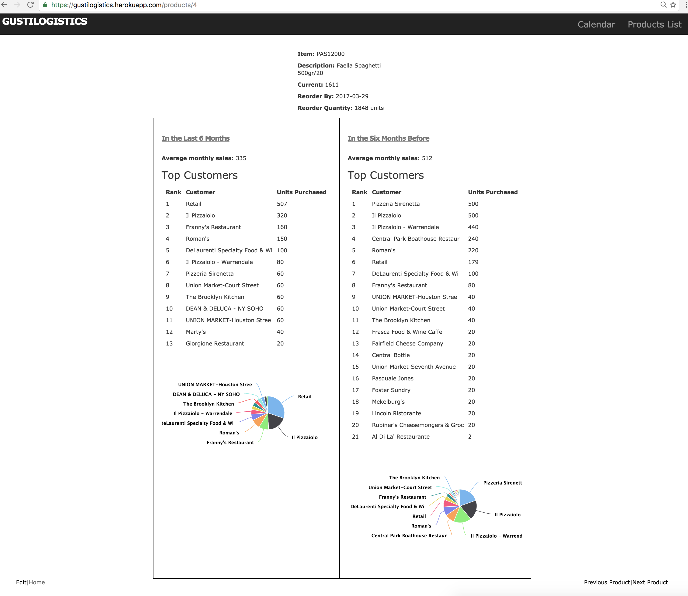
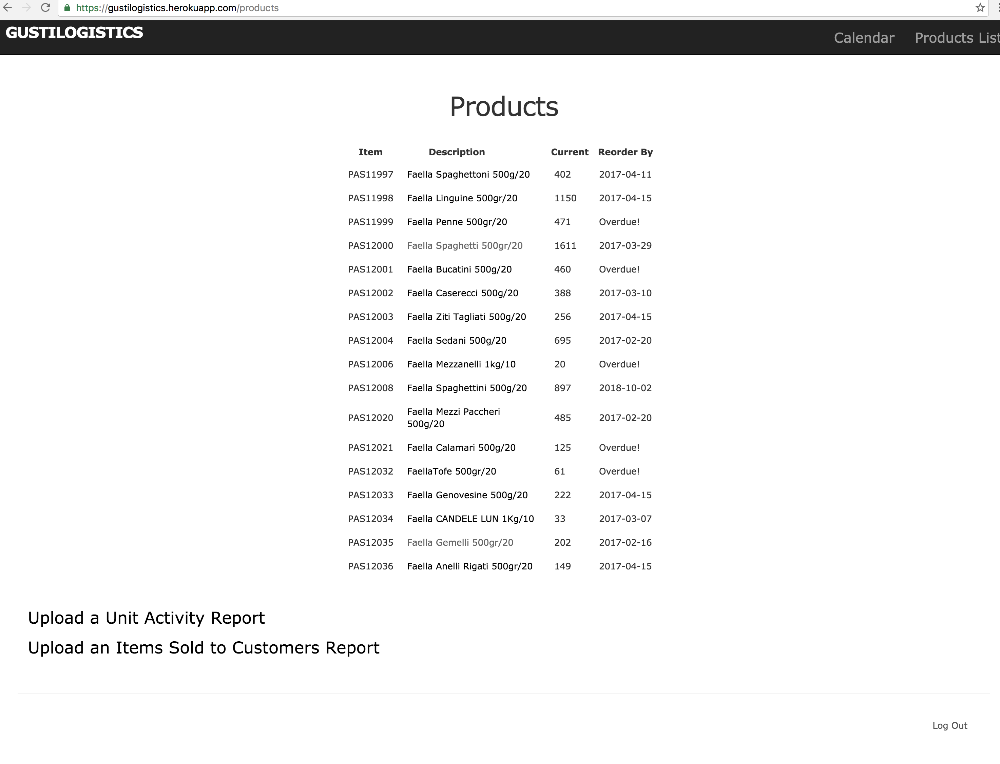

# GustiLogistics

Logistics management Rails App hosted on Heroku that enables my former company [Gustiamo](https://www.gustiamo.com) to manage their supply chain more efficiently via custom Data Analytics, Visualization and Forecasting metrics. 
In short, my app creates visuals for each product's sales by top customers and uses this data to predict future reordering dates and quantities, both of which are rendered on a calendar. 
It also displays product analysis broken down by B2B customers in both a table and a pie chart. 
The app requires authentication to view the most interesting aforementioned parts, so I've included some sample images below. Note that this is still in beta, although it's already offering value to the company. 

* Makes particular use of the following Ruby gems:
  * [Chartkick](https://github.com/ankane/chartkick) for Data Visualization of top customers and sales.
  * [Roo](https://github.com/roo-rb/roo) for parsing Excel spreadsheets downloaded from Inventory Management system.

Here's an example of one of the main features of the application, the Calendar page. It displays what products should be reordered and when. 
Seeing them visually on a Calendar helps my former company envision the bigger picture of ordering, as they need to group orders from different vendors in one vessel from Italy. 

And here's an example of an individual Product analysis page. It lists and displays top B2B customers and total B2C sales for a given product. Currently, sales are broken into the last the 6 months, and the previous 6 months before that as requested by the client. One of my goals in the next few weeks is to enable dynamic querying for any given month range.

All products will be listed along with current quantities and reorder by status.

Finally, users will update their database of purchase sales and raw unit
activities via an Import model that takes an excel spreadsheet. 
The uploaded sheet is available as an argument in ``params``, which is then parsed via the Roo gem and writen to the database as necessary.

