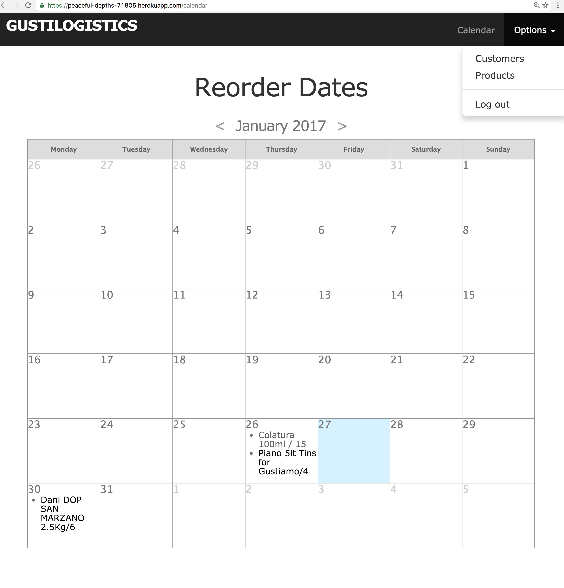
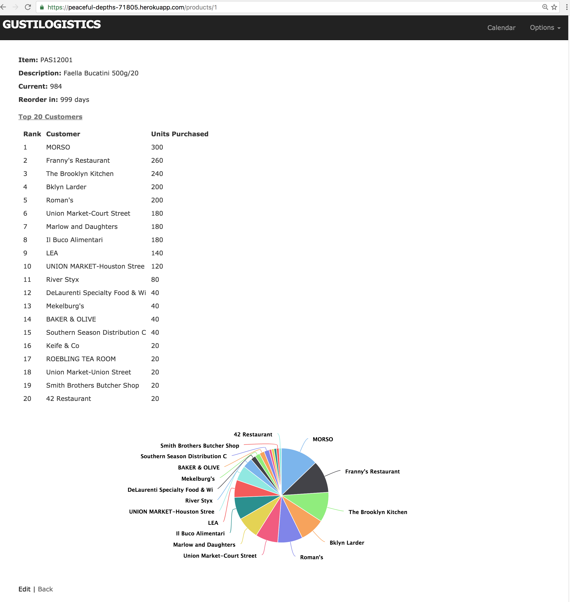

# GustiLogistics

Rails App hosted on Heroku that enables my former company [Gustiamo](https://www.gustiamo.com) to manage their supply chain more efficiently via custom Data Analytics, Visualization and Forecasting tools. In short, my app creates visuals for each product's sales by top customers and uses this data to predict future reordering dates and quantities, both of which are rendered on a calendar. It also enables product analysis broken down by top customers and displayed in a pie chart. The app requires authentication to view the most interesting aforementioned parts, so I've include some sample images below. Note that this is still very much in development, although it's beta version is close to going live. 

* Makes particular use of the following Ruby gems:
  * [Chartkick](https://github.com/ankane/chartkick) for Data Visualization of top customers and sales.
  * [Roo](https://github.com/roo-rb/roo) for parsing Excel spreadsheets downloaded from Inventory Management system.

Here's an example of one of the main features of the application, the Calendar page. It displays what products should be reordered and when. Seeing them visually on a Calendar helps my former company envision the bigger picture of ordering, as they need to group orders from different vendors. 

And here's an example of an individual Product analysis page. It lists and displays top 20 customers for a given product, which helps guide ordering.

